CSS主要用于页面元素美化
CSS：层叠样式表（Cascading Style Sheets）能够对网页中元素位置的排版进行像素级精确控制，支持几乎所有的字体字号样式，拥有对网页对象和模型样式编辑的能力

##### CSS引入方式
###### 行内式
通过元素开始标签的style属性引入，样式语法：`样式名:样式值;样式名:样式值;`
缺点：
- 代码复用度低，不利于维护
- css样式代码和html结构代码交织在一起，影响阅读
代码：
```html
<body>
    <input type="button" value="按钮"
    style="
        width: 60px;
        height: 40px;
        background-color: aqua;
        color: seashell;
        font-size: 20px;
        font-family: '隶书';
        border: 2px solid greenyellow;
        border-radius: 5px;
    " />
</body>
```
效果：


###### 内嵌式
通过在head标签中的style标签定义为本页面的公共样式
并通过选择器确定样式的作用元素
代码：
```html
<head>
    <meta charset="UTF-8">
    <meta name="viewport" content="width=device-width, initial-scale=1.0">
    <title>Document</title>
    <style>
        input {
            width: 60px;
            height: 40px;
            background-color: aqua;
            color: seashell;
            font-size: 20px;
            font-family: '隶书';
            border: 2px solid greenyellow;
            border-radius: 5px;
        }
    </style>
</head>
<body>
    <input type="button" value="按钮" />
    <input type="button" value="按钮" />
    <input type="button" value="按钮" />
    <input type="button" value="按钮" />
</body>
```
效果：


###### 外部样式表
将css代码单独放入一个.css文件中，哪个html需要这些代码就在head中通过link标签引入
代码：
```css
input {
    width: 60px;
    height: 40px;
    background-color: aqua;
    color: seashell;
    font-size: 20px;
    font-family: '隶书';
    border: 2px solid greenyellow;
    border-radius: 5px;
}
```
```html
<head>
    <meta charset="UTF-8">
    <meta name="viewport" content="width=device-width, initial-scale=1.0">
    <title>Document</title>
    <link rel="stylesheet" href="./btn.css">
</head>
<body>
    <input type="button" value="按钮" />
    <input type="button" value="按钮" />
    <input type="button" value="按钮" />
    <input type="button" value="按钮" />
</body>
```
效果：


##### CSS选择器
###### 元素选择器
根据标签的名字确定样式的作用元素
语法：`标签名{}`
缺点：某些同名的元素不希望使用某些样式，某些不同名的元素也使用该样式，都无法协调
代码：
```html
<head>
    <meta charset="UTF-8">
    <meta name="viewport" content="width=device-width, initial-scale=1.0">
    <title>Document</title>
    <style>
        input {
            width: 80px;
            height: 40px;
            background-color: aqua;
            color: white;
            border: 3px solid red;
            font-size: 22px;
            font-family: '隶书';
            line-height: 30px;
            border-radius: 5px;
        }
    </style>
</head>
<body>
    <input type="button" value="按钮" />
    <button>按钮</button>
</body>
```
效果：
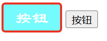

###### id选择器
根据标签的id确定样式的作用元素（一般每个元素都有id属性，但是在一个页面中，id的值不应该相同）
语法：`#id {}`
缺点：id值具有唯一性，样式只能作用到一个样式上
代码：
```html
<head>
    <meta charset="UTF-8">
    <meta name="viewport" content="width=device-width, initial-scale=1.0">
    <title>Document</title>
    <style>
        #btn3 {
            width: 80px;
            height: 40px;
            background-color: aqua;
            color: white;
            border: 3px solid red;
            font-size: 22px;
            font-family: '隶书';
            line-height: 30px;
            border-radius: 5px;
        }
    </style>
</head>
<body>
    <input id="btn1" type="button" value="按钮" />
    <input id="btn2" type="button" value="按钮" />
    <input id="btn3" type="button" value="按钮" />
    <input id="btn4" type="button" value="按钮" />
    <button id="btn5">按钮</button>
</body>
```
效果：
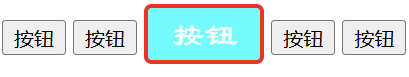

###### class选择器
根据元素的class属性值确定样式的作用元素
元素的class值可以重复，而且一个元素的class属性可以有多个值
代码：
```html
<head>
    <meta charset="UTF-8">
    <meta name="viewport" content="width=device-width, initial-scale=1.0">
    <title>Document</title>
    <style>
        .shapeClass {
            width: 80px;
            height: 40px;
            border-radius: 5px;
        }
        .colorClass {
            background-color: aqua;
            color: snow;
            border: 3px solid blue;
        }
        .fontClass {
            font-size: 20px;
            font-family: '隶书';
            line-height: 30px;
            font-weight: bold;
        }
    </style>
</head>
<body>
    <input id="btn1" class="shapeClass colorClass fontClass" type="button" value="按钮" />
    <input id="btn2" class="shapeClass fontClass" type="button" value="按钮" />
    <input id="btn3" class="colorClass fontClass" type="button" value="按钮" />
    <input id="btn4" type="button" value="按钮" />
    <button id="btn5">按钮</button>
</body>
```
效果：
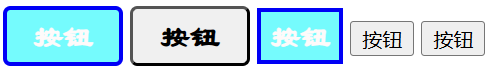


##### CSS浮动
使元素脱离文档流，按照指定的方向（向左或右发生移动），直到它的外边缘碰到包含框或另一个浮动框的边框为止
- 浮动设计是为了解决文字环绕图片的问题，浮动后一定不会将文字挡住
- 文档流是文档中可显示对象在排列时所占用的位置/空间，而脱离文档流就是在页面中不占位置了

浮动前：
代码：
```html
<head>
    <meta charset="UTF-8">
    <meta name="viewport" content="width=device-width, initial-scale=1.0">
    <title>Document</title>
    <style>
        .outerDiv {
            width: 500px;
            height: 300px;
            border: 1px solid black;
            background-color: aquamarine;
        }
        .innerDiv {
            width: 100px;
            height: 100px;
            border: 1px solid black;
            display: block; /* block块 inline行内 */
        }
        .d1 {
            background-color: red;
        }
        .d2 {
            background-color: green;
        }
        .d3 {
            background-color: blue;
        }
    </style>
</head>
<body>
    <div class="outerDiv">
        <div class="innerDiv d1"> diva </div>
        <div class="innerDiv d2"> divb </div>
        <div class="innerDiv d3"> divc </div>
    </div>
</body>
```
效果：
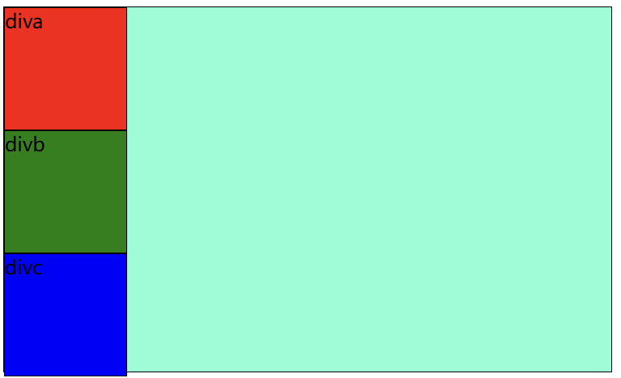

diva向右浮动：
代码：
```html
<head>
    <meta charset="UTF-8">
    <meta name="viewport" content="width=device-width, initial-scale=1.0">
    <title>Document</title>
    <style>
        .outerDiv {
            width: 500px;
            height: 300px;
            border: 1px solid black;
            background-color: aquamarine;
        }
        .innerDiv {
            width: 100px;
            height: 100px;
            border: 1px solid black;
            display: block;
        }
        .d1 {
            background-color: red;
            float: right;
        }
        .d2 {
            background-color: green;
            
        }
        .d3 {
            background-color: blue;
        }
    </style>
</head>
<body>
    <div class="outerDiv">
        <div class="innerDiv d1"> diva </div>
        <div class="innerDiv d2"> divb </div>
        <div class="innerDiv d3"> divc </div>
    </div>
</body>
```
效果：
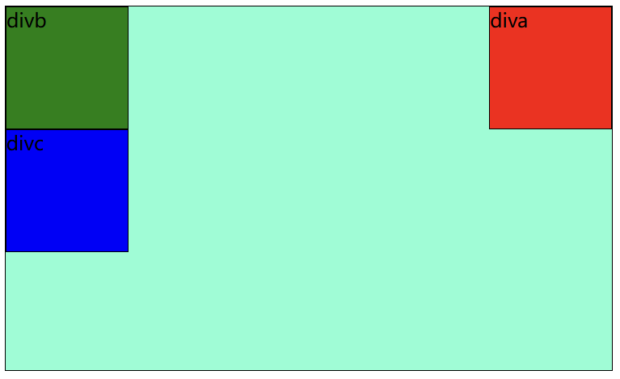

diva向左浮动：
其中diva向左浮动，divb和divc向上浮动，但是diva会覆盖divb的位置，会将divb文字往下挤与divc文字重叠
代码：
```html
<head>
    <meta charset="UTF-8">
    <meta name="viewport" content="width=device-width, initial-scale=1.0">
    <title>Document</title>
    <style>
        .outerDiv {
            width: 500px;
            height: 300px;
            border: 1px solid black;
            background-color: aquamarine;
        }
        .innerDiv {
            width: 100px;
            height: 100px;
            border: 1px solid black;
            display: block;
        }
        .d1 {
            background-color: red;
            float: left;
        }
        .d2 {
            background-color: green;
        }
        .d3 {
            background-color: blue;
        }
    </style>
</head>
<body>
    <div class="outerDiv">
        <div class="innerDiv d1"> diva </div>
        <div class="innerDiv d2"> divb </div>
        <div class="innerDiv d3"> divc </div>
    </div>
</body>
```
效果：
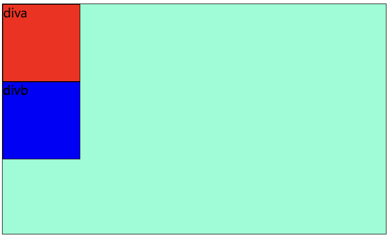

全部向左浮动：
代码：
```html
<head>
    <meta charset="UTF-8">
    <meta name="viewport" content="width=device-width, initial-scale=1.0">
    <title>Document</title>
    <style>
        .outerDiv {
            width: 500px;
            height: 300px;
            border: 1px solid black;
            background-color: aquamarine;
        }
        .innerDiv {
            width: 100px;
            height: 100px;
            border: 1px solid black;
            display: block;
        }
        .d1 {
            background-color: red;
            float: left;
        }
        .d2 {
            background-color: green;
            float: left;
        }
        .d3 {
            background-color: blue;
            float: left;
        }
    </style>
</head>
<body>
    <div class="outerDiv">
        <div class="innerDiv d1"> diva </div>
        <div class="innerDiv d2"> divb </div>
        <div class="innerDiv d3"> divc </div>
    </div>
</body>
```
效果：
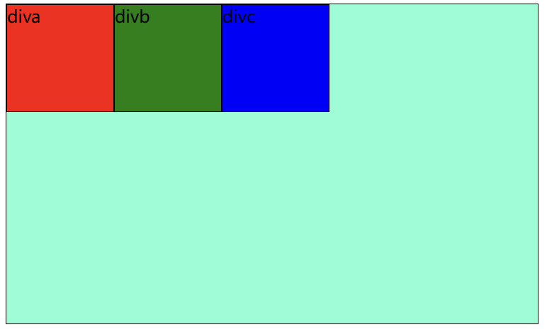


###### CSS定位
position属性指定了元素的定位类型
这个属性定义建立元素布局所用的定位机制。任何元素都可以定位，不过绝对或固定元素会产生一个块级框，而不论该元素本身是什么类型，相对定位元素会相对于它在正常流中的默认位置偏移
元素可以使用的顶部、底部、左侧和右侧属性定位。然而这些属性无法工作，除非是先设定position属性。他们也有不同的工作方式，这取决于定位方式

position：
- static，默认，静态
- absolute，绝对，相对浏览器页面
- relative，相对，相对元素原本的位置（不会释放文档流）
- fixed，相对，相对浏览器窗口的位置

- top
- bottom
- right
- left

###### CSS盒子模型
所有HTML元素可以看作盒子，在CSS中，"box model"这一术语是用来设计和布局时使用
CSS盒模型本质上是一个盒子，封装周围的HTML元素，它包括：边距（margin），边框（border），填充（padding），和实际内容（content）
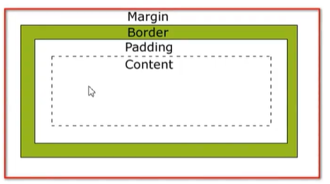
- margin（外边距）：清除边框外的区域，外边距是透明的
- border（边框）：围绕在内边距和内容外的边框
- padding（内边框）：清除内容周围的区域，内边距是透明的
- content（内容）：盒子的内容，显示文本和图像


代码：
```html
<head>
    <meta charset="UTF-8">
    <meta name="viewport" content="width=device-width, initial-scale=1.0">
    <title>Document</title>
    <style>
        .outerDiv {
            width: 500px;
            height: 300px;
            border: 1px solid black;
            background-color: aquamarine;
            /*
            在设置margin时，
            只有一个值，则上下左右均设置为该值
            两个值时，第一个值设置为上下的外边界值，第二个值设置为左右的外边界值
            四个值时，分别对应为上右下左的外边界值
            */
            margin: 0px auto;
        }
        .innerDiv {
            width: 100px;
            height: 100px;
            border: 1px solid black;
            float: left;
        }
        .d1 {
            background-color: red;
            margin-top: 10px;
            margin-right: 10px;
            margin-left: 10px;
            padding-top: 10px;
            padding-left: 10px;
        }
        .d2 {
            background-color: green;
            margin-left: 10px;
        }
        .d3 {
            background-color: blue;
        }
    </style>
</head>
<body>
    <div class="outerDiv">
        <div class="innerDiv d1"> diva </div>
        <div class="innerDiv d2"> divb </div>
        <div class="innerDiv d3"> divc </div>
    </div>
</body>
```
效果：
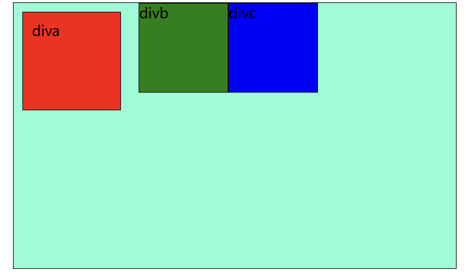
相应位置：
- margin：
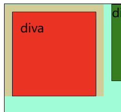
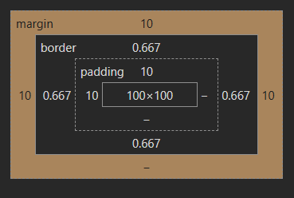
- padding：
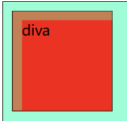
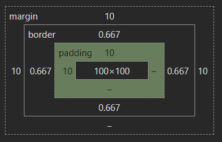
- content：
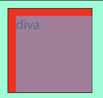
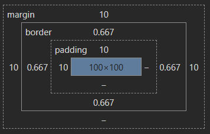

若.d1中margin设置为`margin: 10px 20px 30px 40px`，则效果为
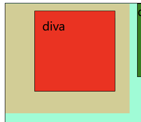
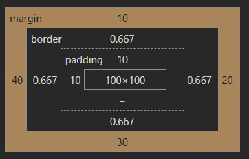