HTML主要用于网页主体结构的搭建

HTML是*超文本标记语言*，其作用是搭建网页结构，在网页上展示内容

HTML的本质是文本文件，而普通的文本文件只能显示字符。但是HTML技术则通过HTML标签把其他网页、图片、音频、视频等各种多媒体资源引入到当前网页中，让网页有了非常丰富的呈现方式，这就是超文本的含义--本身是文本，但是呈现出来的最终效果超越了文本

HTML是一种*标记语言*，是因为其不是像Java这样的编程语言，因为它是由一系列*标签*组成的，没有常量、变量、流程控制、异常处理、ID等等这些功能。
- 双标签：标签是通过一组尖括号+标签名的方式来定义的
`<p>HTML is a very popular fore-end technology.</p>`
使用p标签定义了一个段落，`<p>`叫开始标签，`</p>`叫结束标签。开始标签和结束标签一起构成了一个完整的标签。开始标签和结束标签之间的部分叫文本标签体，也简称：标签体
- 单标签：
`<input type="text" name="username" />`
- 属性：
`<a href="http://www.xxx.com">show detail</a>`
`href="网址"`就是属性，href是属性名，"网址"是属性值


#### HTML 基础结构
- 文档声明：`<!DOCTYPE html>`声明当前文档为html文档
- 根标签：`<html?>``</html>`所有的标签都要在这个标签中间
- 根标签下有两个一级子标签：
    - 头标签：`<head>``</head>`定义那些不直接展示在页面主体上，但是又很重要的内容如字符集、CSS引入、JS引入等
    - 体标签：`<body>``</body>`定义要展示到页面主体的内容
- 注释：`<!-- 注释内容 -->`

- `<meta charset="utf-8" />`告诉浏览器用什么字符集对文件进行解码


#### 专业词汇
- 标签：tag，页面的一对<>
- 属性：attribute，对标签特征进行设置的一种方式（属性一般在开始标签中定义）
- 文本：text，双标签中间的文字
- 元素：element，开始标签+属性+文本+结束标签称之为一个元素


#### 语法规则
- 根标签有且只有一个
- 无论是双标签还是单标签都需要正确关闭
- 标签可以嵌套但是不能交叉嵌套
- 注释语法不能嵌套
- 属性必须有值，值必须加引号，H5中属性名和值相同时可以省略属性值
- HTML中不严格区分字符集使用单双引号
- HTML标签不严格区分大小写，但是不能大小写混用
- HTML中不允许自定义标签名，强行自定义则无效


#### 常见标签
##### 标题标签
标题标签一般用于在页面上定义一些标题性的内容，如新闻标题、文章标题等，有h1到h6六级标题
代码：
```html
<body>
    <h1>一级标题</h1>
    <h2>二级标题</h2>
    <h3>三级标题</h3>
    <h4>四级标题</h4>
    <h5>五级标题</h5>
    <h6>六级标题</h6>
</body>
```
效果：
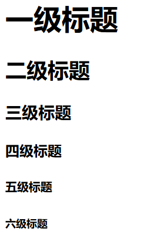

##### 段落标签
可以把html文档分割为若干段落
代码：
```html
<body>
    <p>
        段落内容
    </p>
</body>
```

##### 换行标签
换行标签是一个单标签
在需要换行的文本内容后加上`<br/>`可以实现换行效果
`<hr/>`也可以实现换行，但是会比`<br/>`多定义一条水平线

##### 列表标签
分条列项展示数据的标签，其每一项前面的符号带有顺序特征
列表标签可以嵌套
- 有序列表标签：`<ol>``</ol>`
- 无序列表标签：`<ul?>``</ul>`
- 列表项标签：`<li>``</li>`
代码：
```html
<ol>
    <li>JAVA</li>
    <li>前端</li>
    <li>大数据</li>
</ol>
```
效果：
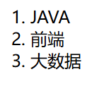
代码：
```html
<ul>
    <li>java</li>
    <li>cpp</li>
    <li>python</li>
</ul>
```
效果：
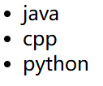

##### 超链接标签
点击后带有链接跳转的标签，也叫做a标签
- href属性用于定义链接
    - href中可以使用绝对路径，以/开头，始终以一个固定路径作为基准路径作为出发点
    - href中也可以使用相对路径，不以/开头，以当前文件所在路径作为出发点
    - href中也可以定义完整的URL
- target用于定义打开的方式
    - _blank在新窗口中打开目标资源
    - _self在当前窗口中打开目标资源

代码：
```html
<body>
    <a href="firstpage.html" target="_blank">相对路径本地资源连接</a> <br/>
    <a href="/demo-html/firstpage.html" target="_self">绝对路径本地资源连接</a> <br/>
    <a href="https://www.w3school.com.cn/" target="_blank">外部资源连接</a> <br/>
</body>
```

##### 多媒体标签
img（重点）图片标签，用于在页面上引入图片
代码：
```html
<!--
src
    用于定义图片的连接
title
    用于定义鼠标悬停时显示的文字
alt
    用于定义图片加载失败时显示的提示文字
-->

```

##### 表格标签
常规表格：
- table标签，表示表格
    - thead标签，表示表头，可以省略不写
    - tbody标签，表示表体，可以省略不写
    - tfoot标签，表示表尾，可以省略不写
    - tr标签，表示一行
    - td标签，表示行内的一格
    - th标签，自带加粗和居中效果的td
代码：
```html
<body>
    <h3 style="text-align: center;"> 员工技能竞赛评分表 </h3>
    <table border="1px" style="margin: 0px auto; width: 300px;">
        <thead>
            <tr>
                <th> 排名 </th>
                <th> 姓名 </th>
                <th> 分数 </th>
            </tr>
        </thead>
        <tbody>
            <tr>
                <td> 1 </td>
                <td> 张三 </td>
                <td> 90 </td>
            </tr>
            <tr>
                <td> 2 </td>
                <td> 李四 </td>
                <td> 80 </td>
            </tr>
            <tr>
                <td> 3 </td>
                <td> 王五 </td>
                <td> 70 </td>
            </tr>
        </tbody>
    </table>
</body>
```
效果：
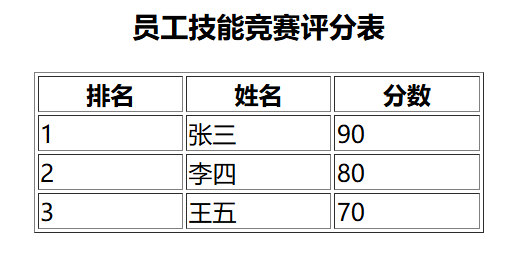

跨行效果：
代码：
```html
<body>
    <h3 style="text-align: center;"> 员工技能竞赛评分表 </h3>
    <table border="1px" style="margin: 0px auto; width: 300px;">
        <thead>
            <tr>
                <th> 排名 </th>
                <th> 姓名 </th>
                <th> 分数 </th>
                <th> 备注 </th>
            </tr>
        </thead>
        <tbody>
            <tr>
                <td> 1 </td>
                <td> 张三 </td>
                <td> 90 </td>
                <td rowspan="3"> 优秀员工 </td> <!-- 使用rowspan设置跨行数 -->
            </tr>
            <tr>
                <td> 2 </td>
                <td> 李四 </td>
                <td> 80 </td>
            </tr>
            <tr>
                <td> 3 </td>
                <td> 王五 </td>
                <td> 70 </td>
            </tr>
        </tbody>
    </table>
</body>
```
效果：
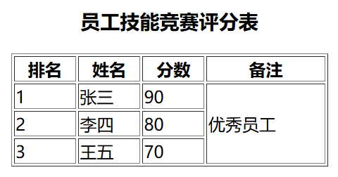

跨列效果：
代码：
```html
<body>
    <h3 style="text-align: center;"> 员工技能竞赛评分表 </h3>
    <table border="1px" style="margin: 0px auto; width: 300px;">
        <thead>
            <tr>
                <th> 排名 </th>
                <th> 姓名 </th>
                <th> 分数 </th>
                <th> 备注 </th>
            </tr>
        </thead>
        <tbody>
            <tr>
                <td> 1 </td>
                <td> 张三 </td>
                <td> 90 </td>
                <td rowspan="6"> 优秀员工 </td>
            </tr>
            <tr>
                <td> 2 </td>
                <td> 李四 </td>
                <td> 90 </td>
            </tr>
            <tr>
                <td> 3 </td>
                <td> 王五 </td>
                <td> 91 </td>
            </tr>
            <tr>
                <td> 总人数 </td>
                <td colspan="2"> 300 </td>
            </tr>
            <tr>
                <td> 平均分 </td>
                <td colspan="2"> 80 </td>
            </tr>
            <tr>
                <td> 及格率 </td>
                <td colspan="2"> 80% </td>
            </tr>
        </tbody>
    </table>
</body>
```
效果：
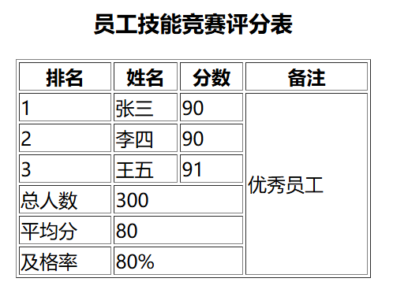

##### 表单标签
表单标签可以实现让用户在界面上输入各种信息并提交的一种标签，是向服务端发送数据主要的方式之一
- form标签，表单标签，其内部用于定义可以让用户输入信息的表单项标签
    - action，form标签的属性之一，用于定义信息提交的服务器地址
        - url
        - 相对路径
        - 绝对路径
    - method，form标签的属性之一，用于定义信息的提交方式
        - get，数据会缀到url后，以?作为参数开始的标志，多个参数用&分隔开（参数会以键值对形式放在url后提交，如：url?key=value&key=value），
            - 数据直接暴露在地址栏上，相对不安全
            - 地址栏长度有限制，所以提交的数据量不大
            - 地址栏上只能是字符，不能提交文件
            - 相比于post，效率高一些
        - post，数据会通过请求体发送，不会在缀到url后
            - 参数默认不放到url后面
            - 数据不会直接暴露在地址栏上，相对安全
            - 数据是单独打包通过请求体发送，提交的 数据量比较大
            - 请求体中，可以是字符，也可以是字节，可以提交文件
代码：
```html
<body>
    <form action="accept.html" method="get">
        用户名: <input type="text" name="username" /> <br>
        密码: <input type="password" name="userPwd" /> <br>
        <input type="submit" value="登录" />
        <input type="reset" value="清空" />
    </form>
</body>
```
效果：
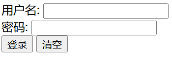

##### 表单项标签
- 表单项标签一定要定义name属性，该属性用于明确提交时的参数名
- 表单项标签还需要定义value属性，该属性用于明确提交时的实参（预设值）

常见的表单项：
- input标签，主要的表单项标签，可以用于定义表单项
    - name，input标签的属性之一，用于定义提交的参数名
    - type，input标签的属性之一，用于定义表单项类型
        - text，单行普通文本框
        - password，密码框
        - submit，提交按钮
        - reset，重置按钮
        - radio，单选框（多个单选框使用相同的name属性值，则会有互斥效果）
        - checkbox，复选框
        - hidden，隐藏域（不显示在页面上，提交时会携带）（希望用户提交一些特定的信息，但是考虑安全问题，或者是用户操作问题，不希望该数据发生改变）
            - readonly，只读，提交时会携带
            - disable，不可用，提交时不会携带
        - file，文件上传框
- textarea标签（双标签），文本域，多行文本框
- select标签，下拉框
    - option，选项

代码：
```html
<body>
    <form action="accept.html" method="post">
        用户名: <input type="text" name="username" /> <br>
        密码: <input type="password" name="userPwd" /> <br>
        性别:
            <input type="radio" name="gender" value="1" checked="checked" /> 男
            <input type="radio" name="gender" value="0" /> 女
            <br>
        爱好：
            <input type="checkbox" name="hobby" value="0" /> 篮球 
            <input type="checkbox" name="hobby" value="1" /> 足球 
            <input type="checkbox" name="hobby" value="2" /> 羽毛球 
            <input type="checkbox" name="hobby" value="3" /> 乒乓球 
            <br>
            个人简介:
            <textarea name="intro">

            </textarea>
            <br>
        籍贯:
            <select name="pro">
                <option value="1"> 北京 </option>
                <option value="2"> 广州 </option>
                <option value="3"> 上海 </option>
                <option value="0" selected> -请选择- </option>
            </select>
            <br>
        文件上传:
            <input type="file" name="file" />
            <br>
        <input type="submit" value="登录" />
        <input type="reset" value="清空" />
    </form>
</body>
```
效果：
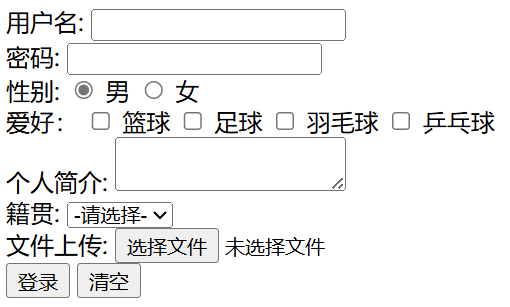

##### 布局相关标签
- div标签，俗称*块*，主要用于划分页面结构，做页面布局（自己独占一行的元素，块元素的CSS样式的宽、高等等，往往都是生效的）
- span标签，俗称*层**行内元素*，主要用于划分元素范围，配合CSS做页面元素样式的修饰（不会自己独占一行的元素，行内的CSS样式的宽、高等等，很多都是不生效的）
代码：
```html
<body style="background-color: aqua;">
    <div style="border: 1px solid red;width: 300px;height: 100px;margin: 10px auto;background-color: bisque;"> 
        <span style="font-size: 20px;color: chartreuse;font-weight: bold;"> 1 </span> <span style="font-size: 40px;color: darkcyan;font-weight: bold;"> 2 </span>3
    </div>
    <div style="border: 1px solid red;width: 300px;height: 100px;margin: 10px auto;background-color: cornflowerblue;"> 
        456 
    </div>
    <div style="border: 1px solid red;width: 300px;height: 100px;margin: 10px auto;background-color: deepskyblue;"> 
        789 
    </div>
</body>
```
效果：
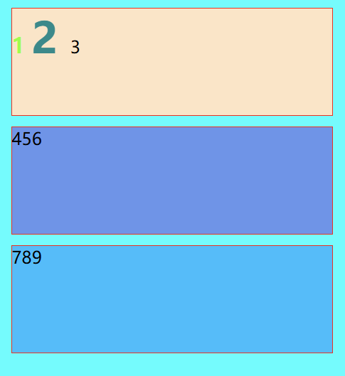

##### 特殊字符
对于html代码，某些符号是有特殊含义的，如果想显示这些特殊符号，需要进行转义
这些有特殊含义的符号，称之为**字符实体**
转义前：
代码：
```html
<body>
    <h1> 1级标题 </h1>
</body>
```
效果：
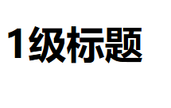
转移后：
代码：
```html
<body>
    &lt;h1&gt; 1级标题 &lt;/h1&gt;
</body>
```
效果：
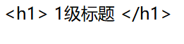